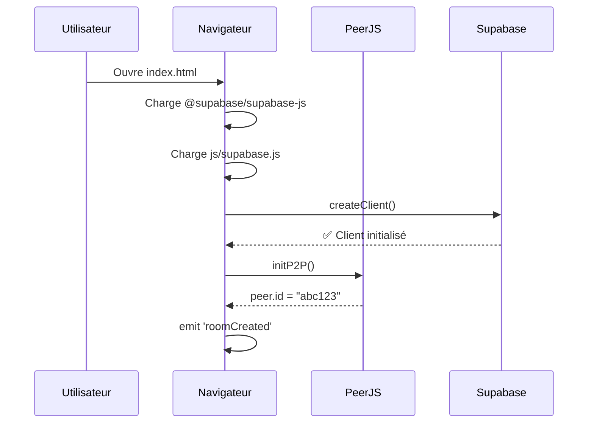

# 🌐 Interconnexion des Joueurs via Supabase

**Date** : 21 décembre 2025  
**Technologie** : Supabase Realtime Presence API

---

## 📡 Vue d'ensemble

Les joueurs s'interconnectent via **Supabase Realtime**, un système de WebSocket temps réel qui permet :
- 🔴 Présence en ligne (qui est connecté)
- 📨 Messages broadcast (diffusion globale)
- 🔄 Synchronisation automatique (tous les clients)

**Aucune base de données** n'est utilisée pour le lobby (uniquement mémoire volatile).

---

## 🔧 Architecture Technique

### 1. Initialisation Supabase

**Fichier** : [js/supabase.js](js/supabase.js#L1-50)

```javascript
// Configuration
const SUPABASE_CONFIG = {
    url: 'https://dmszyxowetilvsanqsxm.supabase.co',
    anonKey: 'eyJhbGc...' // Clé publique anon
};

// Création du client
supabase = window.supabase.createClient(
    SUPABASE_CONFIG.url,
    SUPABASE_CONFIG.anonKey,
    {
        auth: {
            persistSession: true,
            autoRefreshToken: true
        }
    }
);
```

**État** : ✅ Le client `supabase` est **global** et accessible partout via `window.supabase`

---

## 🌊 Flux d'Interconnexion Complet

### Étape 1 : Connexion au site



### Étape 2 : Création du Channel Realtime

**Fichier** : [js/realtime-lobby.js](js/realtime-lobby.js#L24-29)

```javascript
// Créer un channel partagé "lobby:public"
this.channel = supabase.channel('lobby:public', {
    config: {
        broadcast: { self: true },  // Recevoir ses propres messages
        presence: { key: '' }        // Utiliser peer_id comme clé
    }
});
```

**Concept clé** : Tous les joueurs se connectent au **même channel** `lobby:public`

### Étape 3 : Abonnement aux événements

**Fichier** : [js/realtime-lobby.js](js/realtime-lobby.js#L31-47)

```javascript
this.channel
    // 🔄 Synchronisation complète (quand state change)
    .on('presence', { event: 'sync' }, () => {
        this.syncPresence();
    })
    
    // ➕ Joueur arrive
    .on('presence', { event: 'join' }, ({ newPresences }) => {
        this.handlePresenceJoin(newPresences);
    })
    
    // ➖ Joueur part
    .on('presence', { event: 'leave' }, ({ leftPresences }) => {
        this.handlePresenceLeave(leftPresences);
    })
    
    // 📡 S'abonner au channel
    .subscribe(async (status) => {
        if (status === 'SUBSCRIBED') {
            await this.registerMyPresence();
            this.startHeartbeat();
        }
    });
```

**Événements Supabase** :
- `sync` : État global mis à jour (tous les joueurs)
- `join` : Nouveau joueur connecté
- `leave` : Joueur déconnecté

### Étape 4 : Enregistrement de présence

**Fichier** : [js/realtime-lobby.js](js/realtime-lobby.js#L77-92)

```javascript
async registerMyPresence() {
    const username = window.authSystem?.getCurrentUser()?.username || 'Joueur';
    const peerId = window.simpleChatSystem.peer.id;

    this.myPresence = {
        peer_id: peerId,           // Identifiant unique PeerJS
        username: username,         // Nom du joueur
        avatar: '😊',              // Avatar par défaut
        room_code: null,           // Null = disponible
        room_mode: 'manual',       // auto/manual
        status: 'available',       // available/in_room/in_game
        last_seen: new Date().toISOString()
    };

    // 📡 ENVOYER MA PRÉSENCE à Supabase
    await this.channel.track(this.myPresence);
}
```

**Méthode magique** : `channel.track()` 🎯

Cette méthode :
1. Envoie mes données à Supabase via WebSocket
2. Supabase stocke en **RAM** (pas en DB)
3. Supabase diffuse automatiquement aux autres joueurs
4. Données effacées automatiquement si déconnexion

### Étape 5 : Synchronisation état global

**Fichier** : [js/realtime-lobby.js](js/realtime-lobby.js#L103-120)

```javascript
syncPresence() {
    // 📥 RÉCUPÉRER l'état global depuis Supabase
    const state = this.channel.presenceState();
    
    // Format : { "peer_id_1": [presence1], "peer_id_2": [presence2], ... }
    
    this.onlinePlayers.clear();
    
    Object.keys(state).forEach(peerId => {
        const presences = state[peerId];
        const presence = presences[0]; // Première présence
        
        // Stocker localement
        this.onlinePlayers.set(presence.peer_id, presence);
    });

    console.log(`👥 ${this.onlinePlayers.size} joueur(s) en ligne`);
    
    // 🔔 Notifier l'UI
    this.notifyPresenceUpdate();
}
```

**Flux** :
```
Supabase RAM → presenceState() → onlinePlayers Map → UI
```

---

## 🔄 Maintien de la Connexion

### Heartbeat toutes les 30 secondes

**Fichier** : [js/realtime-lobby.js](js/realtime-lobby.js#L150-159)

```javascript
startHeartbeat() {
    this.heartbeatInterval = setInterval(async () => {
        if (this.myPresence && this.channel) {
            // Mettre à jour timestamp
            this.myPresence.last_seen = new Date().toISOString();
            
            // Re-track pour dire "je suis toujours là"
            await this.channel.track(this.myPresence);
        }
    }, 30000); // 30s
}
```

**Pourquoi** : Supabase supprime automatiquement les présences inactives après ~60s

---

## 🔥 Événements Temps Réel

### Joueur rejoint

```javascript
handlePresenceJoin(newPresences) {
    newPresences.forEach(presence => {
        // Ajouter à la liste locale
        this.onlinePlayers.set(presence.peer_id, presence);
        console.log('➕', presence.username, 'a rejoint le lobby');
    });

    // Rafraîchir l'UI automatiquement
    this.notifyPresenceUpdate();
}
```

**Résultat** : L'UI se met à jour **instantanément** sans polling

### Joueur part

```javascript
handlePresenceLeave(leftPresences) {
    leftPresences.forEach(presence => {
        // Retirer de la liste locale
        this.onlinePlayers.delete(presence.peer_id);
        console.log('➖', presence.username, 'a quitté le lobby');
    });

    this.notifyPresenceUpdate();
}
```

---

## 🎨 Mise à jour de l'UI

### Dispatch d'événements custom

**Fichier** : [js/realtime-lobby.js](js/realtime-lobby.js#L238-247)

```javascript
notifyPresenceUpdate() {
    const players = this.getAvailablePlayers();
    
    // 🔔 Événement global pour l'UI
    window.dispatchEvent(new CustomEvent('presence_updated', {
        detail: { 
            players: players, 
            count: this.onlinePlayers.size 
        }
    }));
}
```

### Écoute dans l'UI

**Fichier** : [js/lobby-tabs.js](js/lobby-tabs.js#L19-27)

```javascript
setupPresenceListeners() {
    // Écouter les changements
    window.addEventListener('presence_updated', () => {
        if (this.currentView === 'lobby') {
            this.renderLobbyView(); // Rafraîchir automatiquement
        }
    });
}
```

**Résultat** : 
```
Supabase event → syncPresence() → dispatch 'presence_updated' → UI refresh
```

---

## 📊 Comparaison avec l'Ancien Système

| Fonctionnalité | Ancien (localStorage) | Nouveau (Supabase) |
|----------------|----------------------|-------------------|
| **Portée** | 🏠 Même navigateur | 🌐 Tous les appareils |
| **Latence** | ~3s (polling) | <100ms (WebSocket) |
| **Synchronisation** | Manuelle | Automatique |
| **Nettoyage** | Manuel (stale data) | Automatique (60s) |
| **Déconnexion** | Non détectée | Détectée instantanément |
| **Multi-onglets** | BroadcastChannel | Inclus nativement |

---

## 🔐 Sécurité & Privacy

### 1. Authentification anonyme

```javascript
// Les joueurs utilisent leur peer_id (généré aléatoirement)
peer_id: "abc123xyz"  // Pas d'email, pas de compte requis
```

### 2. Pas de stockage permanent

**Données volatiles** :
- ✅ Stockées en RAM Supabase
- ✅ Effacées automatiquement à la déconnexion
- ❌ Jamais sauvegardées en base de données

### 3. Connexions P2P directes

**Pour le jeu** :
```
Joueur A ←→ PeerJS ←→ Joueur B
(connexion directe, pas via Supabase)
```

**Supabase ne sert qu'à** :
- Découvrir les joueurs disponibles
- Afficher leur statut (disponible/occupé)

---

## 🚀 Flux Complet Résumé

```
1. CONNEXION
   User → index.html → Supabase client créé

2. PEER GENERATION
   PeerJS → peer.id généré → emit 'roomCreated'

3. CHANNEL CREATION
   realtime-lobby.js → supabase.channel('lobby:public')

4. SUBSCRIPTION
   .subscribe() → Status SUBSCRIBED

5. REGISTER PRESENCE
   .track(myPresence) → Données envoyées à Supabase

6. SYNC STATE
   presenceState() → Récupérer tous les joueurs

7. LISTEN EVENTS
   'join' → Nouveau joueur
   'leave' → Joueur parti
   'sync' → État global changé

8. UI UPDATE
   dispatch 'presence_updated' → lobby-tabs refresh

9. HEARTBEAT
   Toutes les 30s → .track() pour rester actif

10. CLEANUP
    beforeunload → channel.unsubscribe()
```

---

## 🧪 Test de Connexion

### Console Browser (F12)

```javascript
// Vérifier si Supabase est connecté
console.log('Supabase:', !!supabase);

// Vérifier le channel
console.log('Channel:', realtimeLobbySystem.channel?.topic);

// Voir tous les joueurs
console.log('Joueurs:', Array.from(realtimeLobbySystem.onlinePlayers.values()));

// État du channel
realtimeLobbySystem.channel.presenceState();
```

### Logs attendus

```
🌐 Initialisation Lobby Realtime Supabase...
✅ Lobby Realtime connecté
✅ Présence enregistrée: MonUsername abc123xyz
💓 Heartbeat démarré (30s)
👥 3 joueur(s) en ligne
```

---

## 🐛 Dépannage

### Erreur "Supabase non configuré"

```
⚠️ Supabase non configuré, utilisation du système P2P local
```

**Solution** : Vérifier [js/supabase.js](js/supabase.js#L7-9) contient URL et anonKey

### Présence non visible

**Checklist** :
1. ✅ Peer ID généré ? `window.simpleChatSystem.peer.id`
2. ✅ Channel subscribed ? `realtimeLobbySystem.isInitialized`
3. ✅ Heartbeat actif ? Logs toutes les 30s
4. ✅ Firewall/VPN bloque WebSocket ?

### Joueur bloqué "en ligne" après déconnexion

**Cause** : Heartbeat non arrêté  
**Solution** : Automatique après 60s (Supabase cleanup)

---

## 📚 Ressources

- **Supabase Realtime Docs** : https://supabase.com/docs/guides/realtime
- **Presence API** : https://supabase.com/docs/guides/realtime/presence
- **WebSocket Protocol** : RFC 6455

---

## ✅ Conclusion

L'interconnexion Supabase offre :

- 🌐 **Portée globale** : Tous les joueurs, tous les appareils
- ⚡ **Temps réel** : <100ms de latence via WebSocket
- 🔄 **Auto-sync** : Pas de code de synchronisation manuel
- 🧹 **Auto-cleanup** : Présences obsolètes supprimées automatiquement
- 🔐 **Anonyme** : Pas de compte requis, peer_id aléatoire
- 💾 **Volatile** : Aucune donnée persistante, uniquement RAM

**Résultat** : Découverte de joueurs simple, rapide et fiable sans serveur custom !
