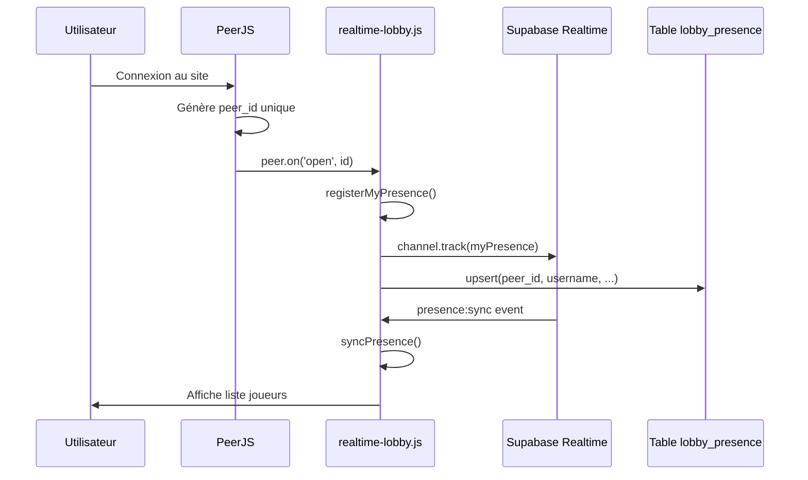

# 🔍 Logique de Découverte des Joueurs

## 📊 Vue d'ensemble

Le système utilise **deux canaux de découverte** :

### 1. 🌍 Lobby Public (Supabase Realtime)
**Fichiers** : `realtime-lobby.js`, `lobby-tabs.js`

### 2. 🔒 Salles P2P (PeerJS + localStorage)
**Fichiers** : `presence-system.js`, `simple-chat.js`

---

## 🌍 Lobby Public - Découverte via Supabase Realtime

### Flux d'enregistrement



### Code actuel (realtime-lobby.js)

```javascript
// 1. Initialisation
async init() {
    // Créer channel Supabase
    this.channel = supabase.channel('lobby:public', {
        config: {
            broadcast: { self: true },
            presence: { key: '' }
        }
    });

    // Écouter les événements
    this.channel
        .on('presence', { event: 'sync' }, () => this.syncPresence())
        .on('presence', { event: 'join' }, ({ newPresences }) => this.handlePresenceJoin(newPresences))
        .on('presence', { event: 'leave' }, ({ leftPresences }) => this.handlePresenceLeave(leftPresences))
        .subscribe(async (status) => {
            if (status === 'SUBSCRIBED') {
                await this.registerMyPresence();
                this.startHeartbeat();
            }
        });
}

// 2. Enregistrement
async registerMyPresence() {
    const peerId = window.simpleChatSystem.peer.id;
    const username = window.authSystem?.getCurrentUser()?.username || 'Joueur';
    
    this.myPresence = {
        peer_id: peerId,
        username: username,
        avatar: '😊',
        room_code: null,
        room_mode: 'manual',
        status: 'lobby',
        last_seen: new Date().toISOString()
    };
    
    // Track dans le channel (mémoire)
    await this.channel.track(this.myPresence);
    
    // Sauvegarder dans la DB (persistance)
    await supabase
        .from('lobby_presence')
        .upsert(this.myPresence, { onConflict: 'peer_id' });
}

// 3. Synchronisation
syncPresence() {
    const state = this.channel.presenceState();
    
    this.onlinePlayers.clear();
    
    Object.keys(state).forEach(peerId => {
        const presences = state[peerId];
        const presence = presences[0];
        this.onlinePlayers.set(presence.peer_id, presence);
    });
    
    console.log(`👥 ${this.onlinePlayers.size} joueur(s) en ligne`);
}
```

### ⚠️ Problème identifié #1 : Double enregistrement

**Ligne 91** : `await this.channel.track(this.myPresence);`
**Ligne 94** : `await supabase.from('lobby_presence').upsert(...)`

**Impact** :
- Données dupliquées : mémoire (channel) + DB (table)
- Incohérence possible si l'un échoue

**Recommandation** :
```javascript
// Option 1 : Utiliser UNIQUEMENT le channel (éphémère)
await this.channel.track(this.myPresence);
// Avantage : Automatique, pas de cleanup manuel

// Option 2 : Utiliser UNIQUEMENT la DB (persistant)
await supabase.from('lobby_presence').upsert(...);
// Puis écouter les changements avec .on('postgres_changes')
```

### ⚠️ Problème identifié #2 : Auto-initialisation avec timeout

**Lignes 323-340** :
```javascript
const waitForPeer = setInterval(async () => {
    if (window.simpleChatSystem?.peer?.id) {
        clearInterval(waitForPeer);
        await window.realtimeLobbySystem.init();
    }
}, 500);

setTimeout(() => {
    clearInterval(waitForPeer);
    if (!window.realtimeLobbySystem.isInitialized) {
        console.warn('⚠️ Timeout initialisation Lobby Realtime');
    }
}, 10000);
```

**Problème** :
- Si l'utilisateur n'est pas connecté, le timeout tourne dans le vide pendant 10s
- Pas de retry si Supabase échoue

**Recommandation** :
```javascript
// Écouter l'événement 'roomCreated' émis par simple-chat.js
window.addEventListener('roomCreated', async (e) => {
    if (!window.realtimeLobbySystem.isInitialized) {
        await window.realtimeLobbySystem.init();
    }
});
```

---

## 🔒 Salles P2P - Découverte locale

### Flux actuel (presence-system.js)

```javascript
// 1. Création de salle
async createRoom() {
    const roomId = window.simpleChatSystem.peer.id;
    
    // Enregistrer mapping CODE → peer_id
    await this.saveRoomMapping(this.currentRoomCode, roomId);
    
    // S'ajouter à la liste
    this.onlinePlayers.set(roomId, {
        username: this.myUsername,
        peerId: roomId,
        isHost: true
    });
}

// 2. Connexion P2P
async joinRoom(targetPeerId) {
    const conn = this.chatSystem.peer.connect(targetPeerId, {
        reliable: true
    });
    
    conn.on('open', () => {
        conn.send({
            type: 'join_request',
            username: this.myUsername
        });
    });
}
```

### ⚠️ Problème identifié #3 : Pas de broadcast de présence

**Constat** :
- Le système P2P ne diffuse PAS automatiquement la présence aux autres salles
- Chaque salle est isolée
- Les joueurs ne se voient que s'ils sont dans la MÊME salle

**Impact** :
- Un joueur en salle privée n'apparaît PAS dans le lobby public
- Impossible de découvrir les joueurs en salle CODE

---

## 🎯 Logique optimale recommandée

### Architecture proposée

```
┌─────────────────────────────────────────┐
│  COUCHE GLOBALE : Supabase Realtime     │
│  - Tous les joueurs connectés           │
│  - Visible par tous                     │
│  - Mise à jour temps réel               │
└─────────────────────────────────────────┘
           ↓
┌─────────────────────────────────────────┐
│  COUCHE LOCALE : PeerJS P2P             │
│  - Connexions directes 1-à-1            │
│  - Échange de messages                  │
│  - Jeu en temps réel                    │
└─────────────────────────────────────────┘
```

### Flux unifié

```javascript
// 1. Joueur se connecte
initP2P() {
    this.peer = new Peer({...});
    
    this.peer.on('open', async (id) => {
        // A. S'enregistrer dans le lobby global
        await window.realtimeLobbySystem.registerMyPresence();
        
        // B. Créer sa salle P2P (pour recevoir connexions)
        await window.roomSystem.createMyRoom();
    });
}

// 2. Joueur crée salle privée
async createPrivateRoom() {
    const roomCode = generateCode();
    
    // Mettre à jour présence dans lobby
    await window.realtimeLobbySystem.updateMyPresence({
        room_code: roomCode,
        room_mode: 'manual', // ou 'auto'
        status: 'in_room'
    });
}

// 3. Joueur rejoint quelqu'un
async invitePlayer(peerId) {
    // Connexion P2P directe
    const conn = this.peer.connect(peerId);
    
    conn.on('open', () => {
        // Envoyer invitation
        conn.send({ type: 'game_invite' });
        
        // Mettre à jour son statut
        window.realtimeLobbySystem.updateMyPresence({
            status: 'in_game'
        });
    });
}
```

---

## 📋 Checklist de vérification

### ✅ Ce qui fonctionne

- [x] PeerJS génère ID unique
- [x] Supabase channel track presence
- [x] Heartbeat toutes les 30s
- [x] Cleanup au beforeunload
- [x] Gestion join/leave events

### ⚠️ Points à améliorer

- [ ] **Double enregistrement** : Channel + DB → Choisir un seul
- [ ] **Auto-init avec timeout** : Utiliser événements au lieu de polling
- [ ] **Pas de broadcast P2P** : Les salles privées sont invisibles
- [ ] **Statut incohérent** : Un joueur en salle CODE apparaît "disponible"
- [ ] **Pas de mise à jour live** : lobby-tabs est statique maintenant

### 🐛 Bugs potentiels

1. **Race condition** : Si peer s'initialise APRÈS timeout de 10s
2. **Memory leak** : Heartbeat continue même si channel déconnecté
3. **Stale data** : DB peut contenir joueurs déconnectés si cleanup échoue
4. **Collision peer_id** : Aucune gestion si 2 utilisateurs ont même ID (improbable mais possible)

---

## 💡 Recommandations finales

### 1. Unifier la découverte

**Tous les joueurs** → Supabase Realtime (source unique de vérité)

```javascript
// Supprimer presence-system.js (redondant)
// Tout passer par realtime-lobby.js
```

### 2. Statuts clairs

```javascript
status: 'available'  // Dans lobby, disponible
status: 'in_room'    // Dans salle privée (CODE)
status: 'in_game'    // En partie
status: 'busy'       // Occupé
```

### 3. Mise à jour réactive

```javascript
// Au lieu de polling toutes les 3s, écouter événements:
window.addEventListener('player_joined', () => this.renderLobbyView());
window.addEventListener('player_left', () => this.renderLobbyView());
window.addEventListener('status_changed', () => this.renderLobbyView());
```

### 4. Affichage conditionnel

```javascript
renderLobbyView() {
    players.forEach(player => {
        const isAvailable = player.status === 'available';
        const showInviteBtn = isAvailable && !isSelf;
        
        // Afficher badge si en salle
        if (player.room_code) {
            html += `<span class="in-room-badge">🏠 En salle</span>`;
        }
    });
}
```

---

**Date** : 20 décembre 2025
**Statut** : Analyse terminée - Implémentation recommandée
